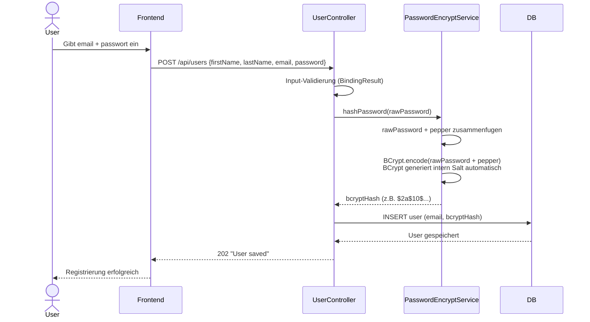
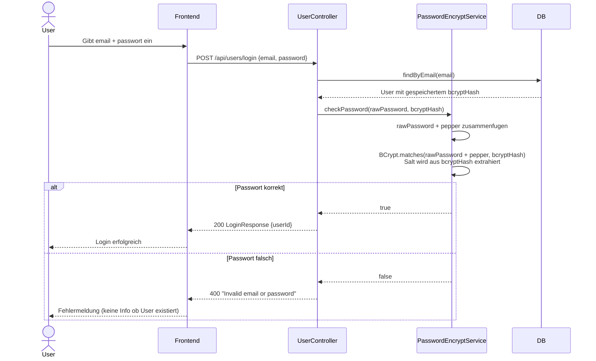
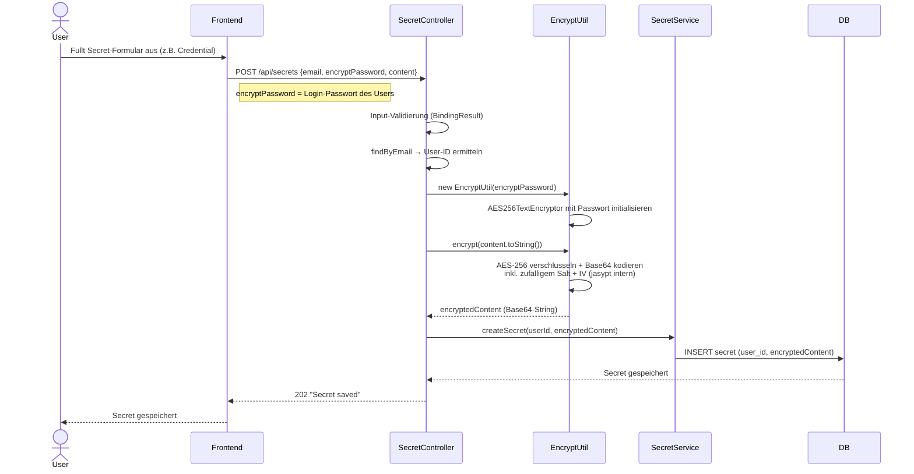
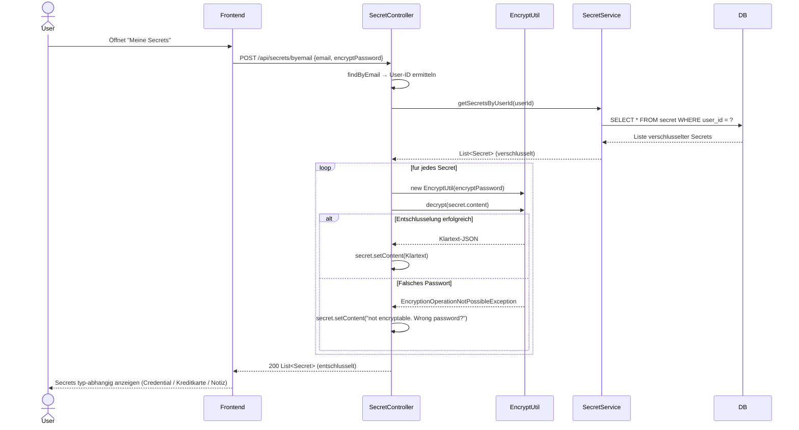

# Kryptografie – Essenz der Umsetzung

## 1. Passwort hashen und prufen

### Registrierung

Beim Registrieren wird das Passwort **nie im Klartext** gespeichert.
Der `PasswordEncryptService` hangt zuerst den **Pepper** ans Passwort an,
dann verschlusselt BCrypt es mit einem zufälligen **Salt** (intern in BCrypt enthalten).

### Login

Beim Login wird das eingegebene Passwort **erneut gehasht** und mit dem gespeicherten Hash verglichen.
BCrypt.matches() extrahiert den Salt aus dem gespeicherten Hash und pruft intern.

---

## 2. Secret verschlusseln und entschlusseln

### Secret speichern (encrypt)

Der `EncryptUtil` verwendet **AES-256** via jasypt.
Als Schlussel dient das **Login-Passwort des Users** – dadurch ist der Schlussel pro User individuell.
Der verschlusselte Inhalt wird als Base64-String in der DB gespeichert.

### Secrets lesen (decrypt)

Beim Laden werden alle Secrets des Users einzeln entschlusselt.
Nur wer das korrekte Passwort kennt, kann den Klartext sehen.

---

## Zusammenfassung Schlussel-Konzept

| | Passwort-Hash | Secret-Verschlusselung |
|---|---|---|
| **Algorithmus** | BCrypt | AES-256 (jasypt) |
| **Salt** | BCrypt-intern (zufällig) | jasypt-intern (zufällig) |
| **Pepper** | Ja, aus `application.properties` | Nein |
| **Schlussel pro User** | Ja (Salt im Hash enthalten) | Ja (Login-Passwort = Schlussel) |
| **Umkehrbar** | Nein (One-way Hash) | Ja (symmetrisch) |
| **Gespeichert in DB** | BCrypt-Hash | Base64-verschlusselter String |
